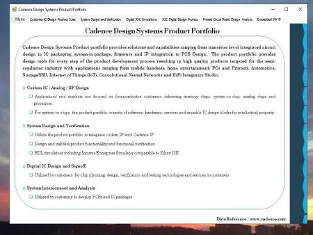
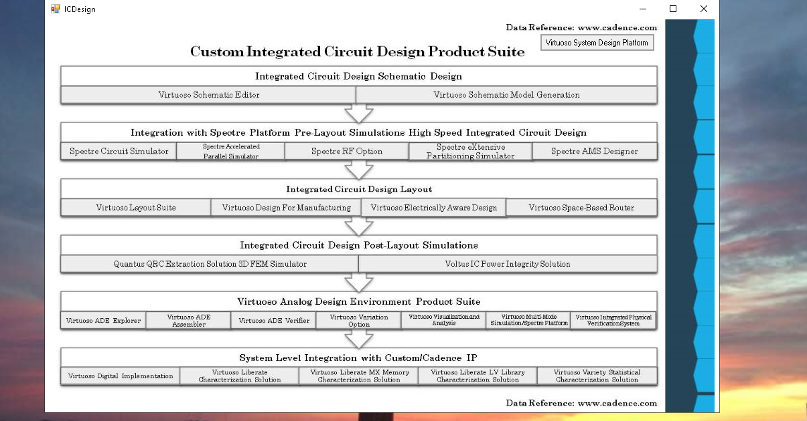
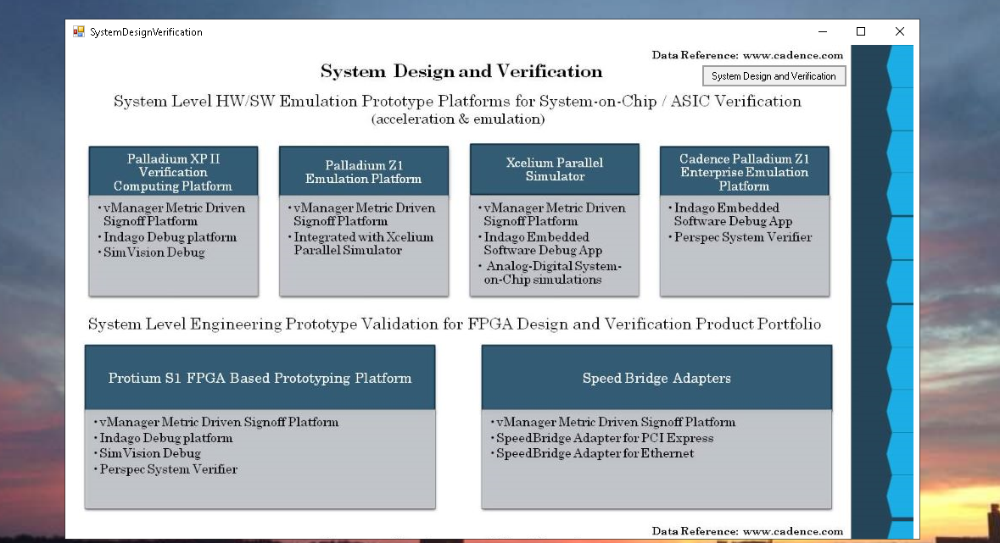
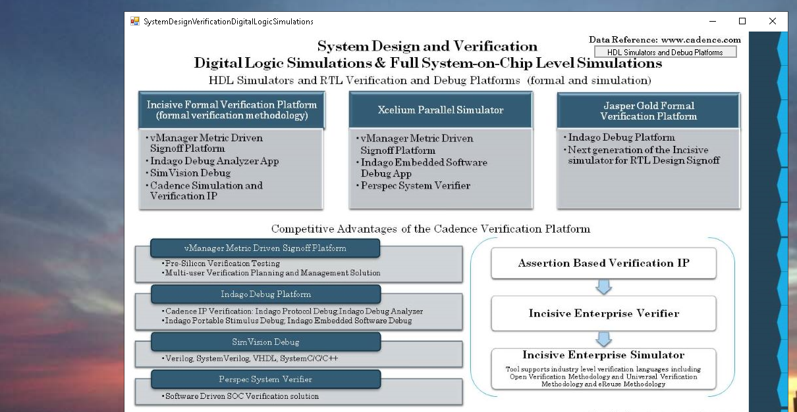
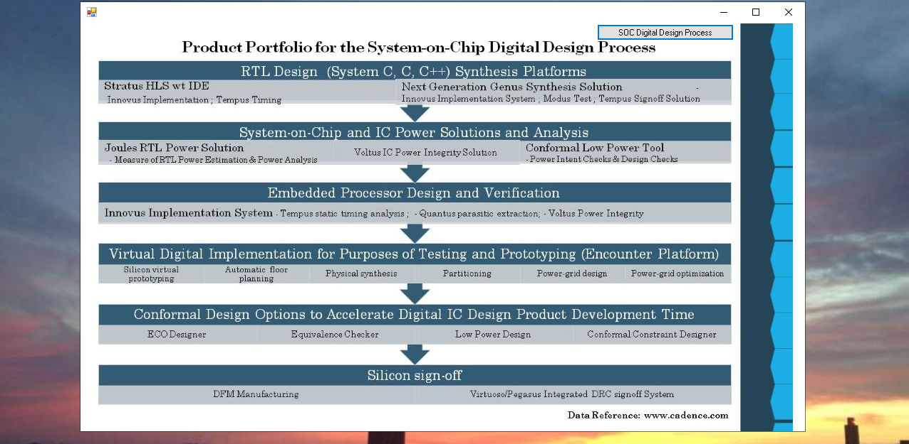
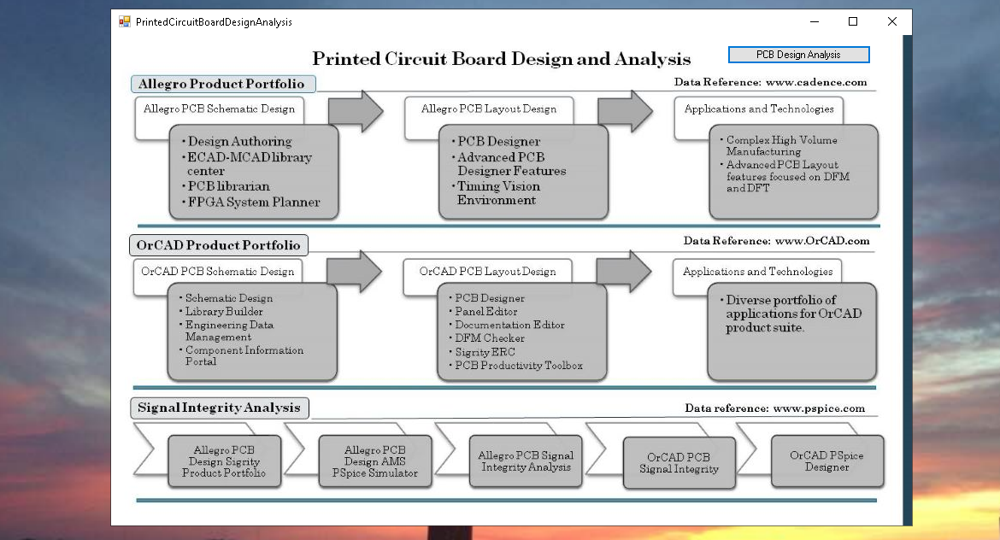
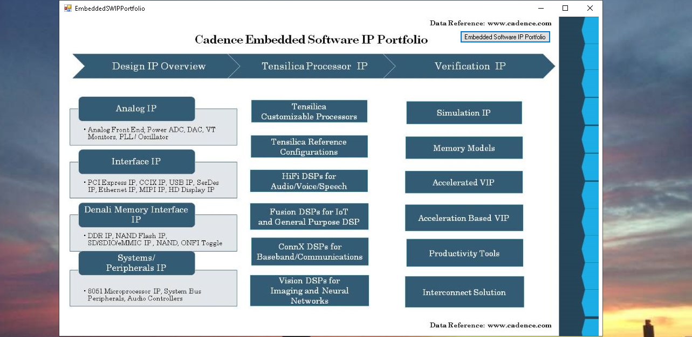
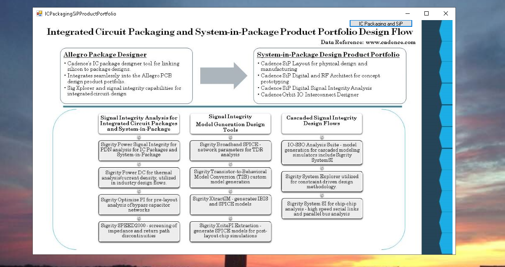
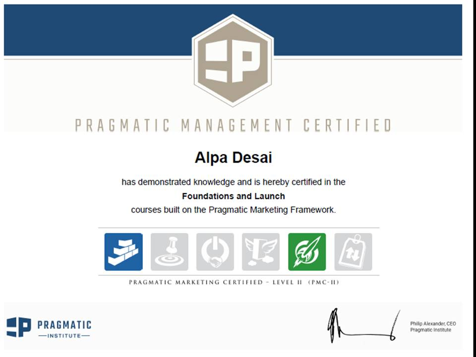
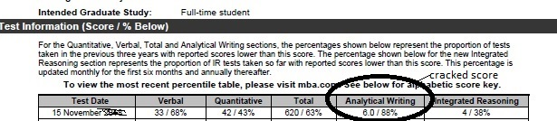

## Cadence Design Systems System Level Design Product Portfolio

The graphical user interface displays a custom interpretation of the public Cadence Design Systems Product Portfolio from www.cadence.com. I do not represent the views of the organization. To download the executable please click on: https://github.com/alpaddesai/SystemLevelDesignProductPortfolio/releases

Company confidential information is not displayed. All images are custom by Alpa D Desai. 

## Custom IC Design Product Suite

## System Design and Verification

## System Design and Verification Digital Logic and SoC Simulations

## SoC Digital Design Process

## Printed Circuit Board Analysis

## Cadence Embedded Software IP Portfolio

## IC Packaging and SiP Design

## Pragmatic Marketing

## GMAT Exam

## Admission letter

## GMAT exam

## Exam

## Ethics and Excellence

Advanced knowledge reference : https://github.com/alpaddesai/ProductMarketing, https://github.com/alpaddesai/ManagingGlobalEnterprise, https://github.com/alpaddesai/TechnicalProductManagement, https://github.com/alpaddesai/RealEstatePortfolioIdea_Travel , https://github.com/alpaddesai/ManagingIntellectualProperty, https://github.com/alpaddesai/HighTechGlobalStrategy, https://github.com/alpaddesai/Internationalbusiness and https://github.com/alpaddesai/PowerandInfluentialSkills.
